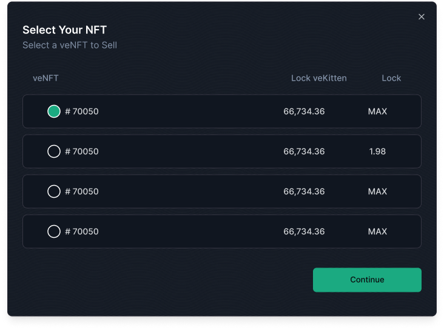

A **Dutch Auction** allows you to sell your veKitten NFT with a **gradual discount** over time.

### Step-by-Step: Creating a Dutch Auction

### 1. **Select your veNFT**

- Choose the veKitten NFT you want to list.
- The UI will auto-fill the lock details.

---

### 2. **Set Auction Parameters**

- **Listing Duration** – Total time your auction will be live (max **60 days**).
- **Start Price** – The initial price the auction begins at.
- **End Price** – The lowest price it will reach through the discount period.
- **Discount End Date** – The date at which the discounting stops.  
  _(e.g., you can run a 60-day auction but have the discounting end on day 30 — price stays flat after that.)_

  #### Example:
   - **Start Price**: 10,000 KITTEN  
   - **End Price**: 5,000 KITTEN  
   - **Discount Duration**: 30 days  

   → The price drops daily by ~167 KITTEN until it hits 5,000  
   → If the auction runs longer (e.g., 60 days), the price stays fixed at 5,000 after day 30

---

### 3. **Review Listing Details**

 * The platform shows a breakdown of your expected proceeds.
   * Because pricing decays over time, you’ll see the **maximum** and **minimum** proceeds depending on when the sale happens.

   #### Example:
   - **Start Price**: 9,000 KITTEN ($9,000)
   - **End Price**: 6,000 KITTEN ($6,000)

   → If sold early, you receive up to **9,000 KITTEN**  
   → If sold at the end, you receive **6,000 KITTEN**

   * **Listing Fee (1.5%)** is deducted from the final sale price.
   * Final proceeds = Sale Price × (1 − 0.015)

---

### 4. **Approve NFT**

- Click **"Approve veNFT"** to give the marketplace permission to manage your NFT.
- This is a one-time approval per NFT contract.

---

### 5. **Create Sale**

- Once approved, click **"Create Sale"**.
- Confirm the transaction in your connected wallet.

---

## What Buyers See

- A dynamic price that **decreases over time** from your start price to end price.
- Buyers can choose to buy at any time—**the longer they wait, the cheaper it gets**, but at the risk of someone else buying first.
