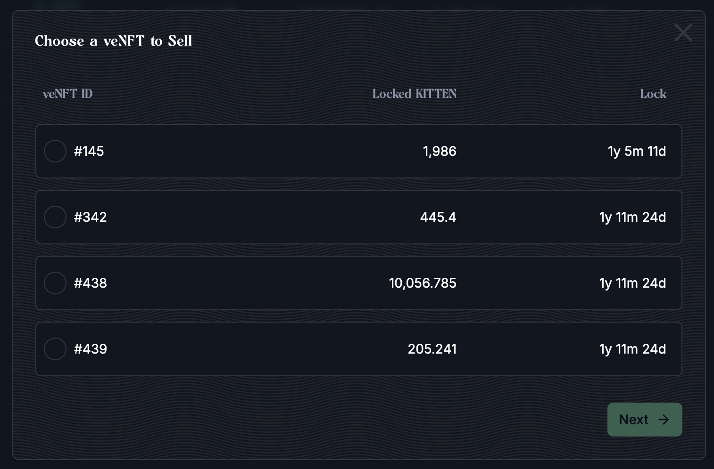

Use a **Fixed Bid** listing when you want to sell your veKitten NFT at a specific discount off its lock value. Here's how to do it:

### Step-by-Step: Listing a veKitten

1. **Select your veNFT**
   * Choose the veKitten NFT you want to list (e.g., `#20`).
   * The UI will auto-fill:
     * **Lock veKitten Amount**
     * **Lock veKitten Value**
     * **Lock veKItten Duration**

2. **Set a Discount**
   * Enter the percentage discount you'd like to offer (e.g., **15%**).
   * The platform automatically calculates the listing price based on the discount:
     * **Listing Price** = Lock Value × (1 − Discount)
     * e.g., $10,000 × 85% = **8,500 KITTEN**

3. **Review Details**
   * **Listing Fee (1.5%)** is subtracted from the sale:
   * **Proceeds** (what you receive if sold):

4. **Approve NFT**
   * Click **"Approve veNFT"** to allow the marketplace contract to manage this NFT.

5. **Create Sale**
   * After approval, finalize the listing by clicking "Create Sale" confirming the transaction in your wallet.

### What Buyers See
* Buyers will see the NFT available at the discounted price (e.g., **8,500 KITTEN** for a **10,000 KITTEN** lock).
* Once purchased, the buyer receives the veKitten NFT and inherits the lock position.
